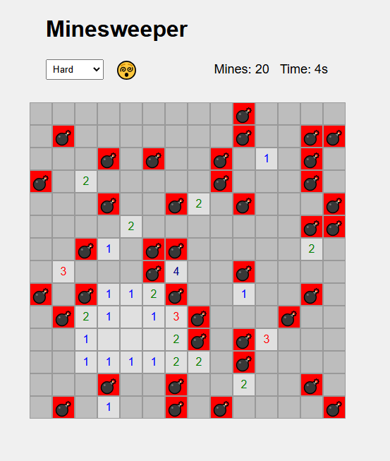

# Minesweeper Game

A modern, web-based Minesweeper game built with HTML, CSS, and JavaScript.

## Features

- **Responsive Design**: Play the game on desktop or mobile devices.
- **Difficulty Levels**: Choose between Easy, Medium, and Hard modes.
- **Interactive UI**: Enjoy animations and modern visuals.
- **Timer and Mine Counter**: Keep track of your time and the remaining mines.

## Preview



## How to Play

- **Objective**: Reveal all cells without triggering any mines.
- **Controls**:
  - **Left Click**: Reveal a cell.
  - **Right Click**: Place or remove a flag on a cell.
- **Tips**:
  - Numbers indicate how many mines are adjacent to a cell.
  - Use flags to mark suspected mines.

## Getting Started

### Prerequisites

- A modern web browser (Chrome, Firefox, Safari, Edge).

### Installation

1. **Clone the repository**:

   ```bash
   git clone https://github.com/sidragosam/test_minesweeper.git
   ```
